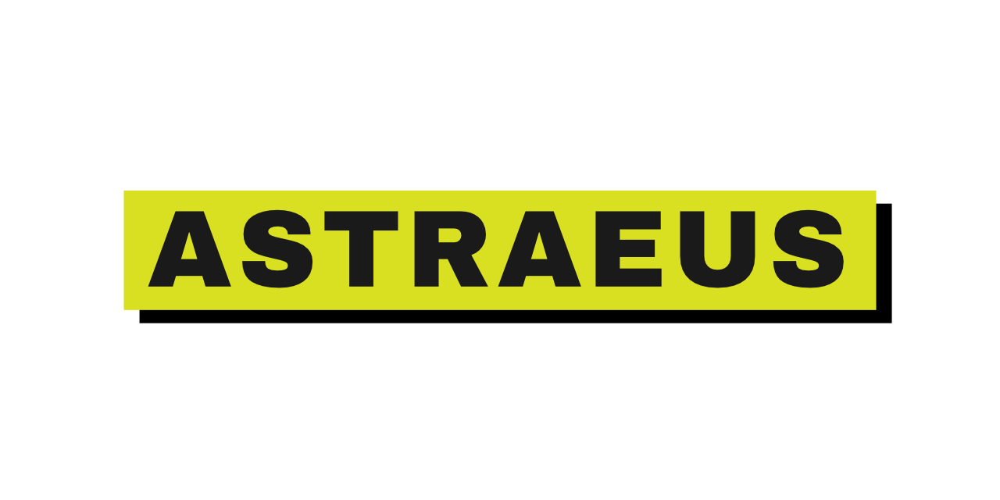

# Astraeus Media

<p align="center">
  
</p>

[](https://github.com/ykzird/astraeus/actions/workflows/ci.yml)

A self-hosted media server in a single Go binary, with a web UI it serves itself.
Point it at a library and it works out how to deliver each file to whoever asked
for it: the original bits when they will do, a remux when the container is the
only problem, a re-encode when it has to. It shells out to `ffmpeg` for the work
and keeps its state in one SQLite file.

No database server, no front-end build step, three Go dependencies.

## What it does

- **Plays what you have.** Direct play with range requests, or HLS remuxed or
  re-encoded, chosen per client from the capability manifest it sends — and every
  choice explained rather than silently made. [More](docs/playback.md)
- **Handles real files.** HDR and Dolby Vision reported and tone mapped for
  clients that cannot show them; hardware encoders verified by running them on
  the machine that starts the server; an adaptive bitrate ladder.
- **Subtitles.** Text tracks served as WebVTT, and PGS or VobSub image tracks
  read into text with OCR when `tesseract` is installed — burn-in for any bitmap
  track otherwise. Burn-in is decided by whether the track is text, so it is not
  limited to a list of codecs; PGS is the one it has been exercised with end to
  end, and DVB burn-in is unverified (see `docs/handoff.md`).
- **Remembers where you were**, per viewer, with a continue-watching list.
- **An access gate, rate limiting and tracing** for when it is not just you.
  [More](docs/configuration.md)
- **Observable.** Prometheus metrics at `/metrics`, and OTLP traces on request.

What is missing is listed honestly in [TODO.md](TODO.md).

## Requirements

- Linux, macOS or Windows to build; the container image is Linux
- [ffmpeg](https://ffmpeg.org/) and `ffprobe` — needed for playback and checked at
  startup; without them the server still starts and lists the library, and the
  media routes answer 503
- [tesseract](https://github.com/tesseract-ocr/tesseract) — optional, for reading
  image subtitles into text instead of burning them into the picture

## Quick start

Build it, then try it against generated demo media:

```sh
go build -o astraeus-server ./cmd/astraeus-server

scripts/make-demo-media.sh
./astraeus-server serve --db demo.db
```

Open <http://127.0.0.1:8642>.

With your own library instead:

```sh
./astraeus-server scan --db astraeus.db --path /media/movies --kind movies
./astraeus-server scan --db astraeus.db --path /media/shows  --kind shows
./astraeus-server enrich --db astraeus.db   # metadata; without a TMDB key it writes placeholders
./astraeus-server serve  --db astraeus.db
```

Flags belong to the command, not the binary: `./astraeus-server <command> -h`.
The whole list is in [configuration](docs/configuration.md#cli).

### Container

```sh
docker run -d --name astraeus -p 127.0.0.1:8642:8642 \
  -v /path/to/media:/media:ro -v astraeus-data:/data \
  ghcr.io/ykzird/astraeus:latest

docker exec astraeus astraeus-server scan --db /data/astraeus.db \
  --path /media/movies --kind movies --name Movies
```

The image includes ffmpeg and tesseract. Releases are tagged (`:0.18.0`) and
published on the [releases page](https://github.com/ykzird/astraeus/releases);
`:latest` follows them. Building the image yourself, running it as a service and
putting TLS in front of it are all in [deployment](deploy/README.md).

## Documentation

| | |
| --- | --- |
| [docs/index.md](docs/index.md) | Every document, and what each one is for |
| [Playback and delivery](docs/playback.md) | How a file reaches a player |
| [Configuration and operations](docs/configuration.md) | Flags, the access gate, rate limiting, tracing |
| [HTTP API](docs/api.md) | The endpoints the web UI uses |
| [Development](docs/development.md) | Tests, browser harnesses, and the layout |
| [SPECIFICATION.md](SPECIFICATION.md) | The design, and the reasoning behind it |
| [TODO.md](TODO.md) | What is missing, honestly |
| [docs/handoff.md](https://github.com/ykzird/astraeus/blob/main/docs/handoff.md) | State for whoever picks this up next (repository only — not in a release archive) |

## Contributing

Issues and pull requests are welcome. [CONTRIBUTING.md](CONTRIBUTING.md) has the
rules this project actually follows; the short version is that a change comes
with a test that fails without it, asserts the artefact rather than the command
line, and updates the docs in the same pull request. `main` requires a pull
request and a green CI run.

Security problems go through [SECURITY.md](SECURITY.md), never a public issue.

## Licence

[MIT](LICENSE). Third-party notices are in
[THIRD_PARTY_NOTICES.md](THIRD_PARTY_NOTICES.md).
